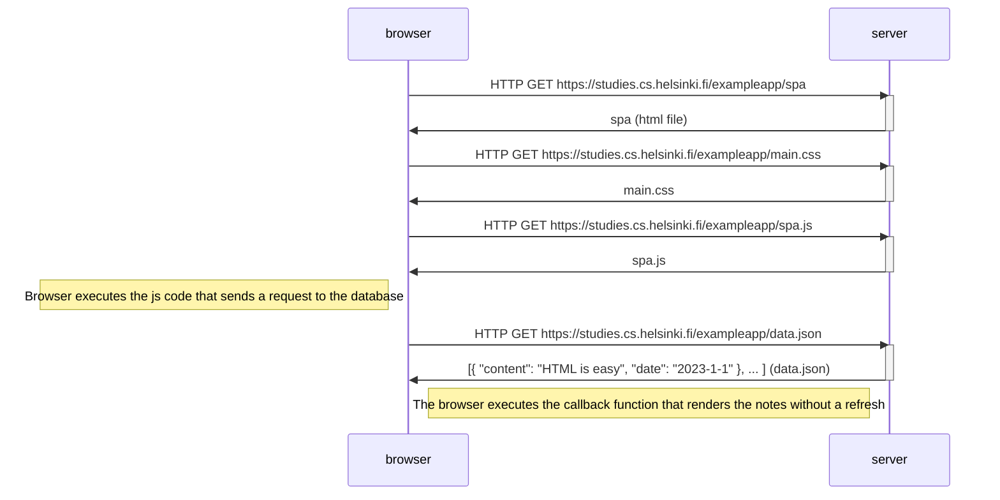

```mermaid
sequenceDiagram
    participant browser
    participant server

    browser->>server: HTTP GET https://studies.cs.helsinki.fi/exampleapp/spa
    activate server
    server->>browser: spa (html file)
    deactivate server

    browser->>server: HTTP GET https://studies.cs.helsinki.fi/exampleapp/main.css
    activate server
    server->>browser: main.css
    deactivate server

    browser->>server: HTTP GET https://studies.cs.helsinki.fi/exampleapp/spa.js
    activate server
    server->>browser: spa.js
    deactivate server
    Note left of browser: Browser executes the js code that sends a request to the database

    browser->>server: HTTP GET https://studies.cs.helsinki.fi/exampleapp/data.json
    activate server
    server->>browser: [{ "content": "HTML is easy", "date": "2023-1-1" }, ... ] (data.json)
    deactivate server

    Note right of browser: The browser executes the callback function that renders the notes without a refresh


```