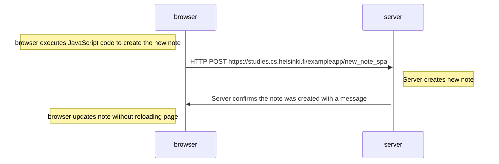

```mermaid
sequenceDiagram
    participant browser
    participant server

    Note left of browser: browser executes JavaScript code to create the new note
    browser->>server: HTTP POST https://studies.cs.helsinki.fi/exampleapp/new_note_spa
    activate server
    Note right of server: Server creates new note
    server->>browser: Server confirms the note was created with a message
    Note left of browser: browser updates note without reloading page
```